# High Availability Nginx WebApp (GitOps Edition)


Welcome to the **HA WebApp** project! This repository contains the declarative infrastructure-as-code (IaC) required to deploy a resilient, auto-scaling Nginx web server on Kubernetes, managed entirely through GitOps principles using **ArgoCD**.

## Architecture

Traffic is securely routed from the public internet via **Cloudflare Tunnels** directly to our internal Kubernetes service, bypassing the need for traditional LoadBalancers or NodePorts. High availability is guaranteed by a **Horizontal Pod Autoscaler (HPA)** that dynamically adjusts capacity based on real-time CPU demand.

```mermaid
graph LR
    User((🌎 Public User)) -->|HTTPS| CF[Cloudflare Edge]
    subgraph "Kubernetes Cluster"
        CFT[cloudflared Deployment] -->|Tunnel| Svc[ClusterIP Service]
        Svc --> Pod1[Nginx Pod 1]
        Svc --> Pod2[Nginx Pod 2]
        Svc --> PodN[Nginx Pod N...]
        
        HPA[⚡ Horizontal Pod Autoscaler] -.->|Monitors CPU| Pod1
        HPA -.->|Monitors CPU| Pod2
        HPA ==>|Scales Replicas 2 to 10| Deploy[Nginx Deployment]
    end
    
    ArgoCD[🐙 ArgoCD] ==>|Syncs| Git[This Repo]
    ArgoCD -->|Applies Manifests| Deploy
```



## Key Features

*   **GitOps Managed:** Single source of truth. All changes are committed here and synced automatically by ArgoCD.
*   **High Availability:** Starts with 2 replicas, ensuring zero downtime during updates or single-node failures.
*   **Auto-Scaling:** The HPA automatically scales the deployment up to **10 replicas** when CPU usage exceeds 50%.
*   **Zero Trust Networking:** Exposed via Cloudflare Tunnel; no open ports on the cluster firewall.

## Repository Structure

```text
.
├── namespace.yaml      # Creates the 'web-apps' namespace isolation
├── deployment.yaml     # The Nginx application definition (requests/limits included)
├── service.yaml        # Internal networking (ClusterIP)
├── hpa.yaml            # Autoscaling rules (CPU > 50%)
└── argocd.yaml         # The ArgoCD Application CRD (GitOps logic)
```

## Deployment

### Prerequisites
*   A Kubernetes Cluster
*   ArgoCD installed
*   Cloudflared installed (for ingress)

### 1. Apply the ArgoCD Application
To bootstrap the project, apply the ArgoCD manifest. This tells ArgoCD to watch this repository.

```bash
kubectl apply -f argocd.yaml
```

ArgoCD will detect the manifests, create the `web-apps` namespace, and deploy the application.

### 2. Configure Cloudflare
In your Cloudflare Zero Trust Dashboard, point your public hostname to the internal service DNS:

*   **Service:** `HTTP`
*   **URL:** `nginx-ha-service.web-apps.svc.cluster.local:80`

## Verification & Load Testing

Want to see the autoscaler in action? We can force a scale-up event by generating artificial CPU load.

1.  **Watch the HPA status:**
    ```bash
    kubectl get hpa -n web-apps -w
    ```

2.  **Generate Load:**
    Run this command to max out the CPU in one of the pods:
    ```bash
    # Get a pod name
    POD=$(kubectl get pods -n web-apps -l app=nginx-ha -o jsonpath="{.items[0].metadata.name}")

    # Run an infinite loop inside the pod
    kubectl exec -it $POD -n web-apps -- sh -c 'yes > /dev/null'
    ```

3.  **Observe:**
    Within 1-2 minutes, you will see the `TARGETS` percentage spike, and the `REPLICAS` count will increase automatically to handle the load.

## 🌍 Multi-Environment Strategy

This project is structured as a **Helm Chart**, allowing easy deployment to multiple environments (Dev, Staging, Prod) by simply overriding the `values.yaml`.

### Option 1: Pure Helm (Recommended)
Create separate value files for each environment:
*   `values-dev.yaml`: Low resources, 1 replica, HPA disabled.
*   `values-prod.yaml`: High resources, HA enabled (2-10 replicas).

In ArgoCD, simply point the Application to the specific values file:
```yaml
source:
  helm:
    valueFiles:
      - values-prod.yaml
```

### Option 2: Helm + Kustomize (Advanced)
If you need to patch the manifests **after** Helm renders them (e.g., adding labels or annotations not supported by the Chart), you can use Kustomize to "inflate" the Helm chart.

**Example `kustomization.yaml`:**
```yaml
apiVersion: kustomize.config.k8s.io/v1beta1
kind: Kustomization

helmCharts:
- name: nginx-ha
  includeCRDs: true
  valuesInline:
    replicaCount: 1 
  releaseName: my-staging-app
  version: 0.1.0
  repo: https://github.com/toyinogun/web-app

# Apply last-mile changes (e.g., adding an environment label)
patches:
- target:
    kind: Deployment
    name: .*
  patch: |-
    - op: add
      path: /metadata/labels/env
      value: staging
```

---
*Built with ❤️ by Toyin*
